# Mapeamento dos Dados de Importação e Exportação para Análise de Cadeias Produtivas

 
API 1° Semestre - Logística Noturno

 
  

   
 
 

## O Projeto

O projeto aborda o mapeamento das cadeias produtivas da Região Metropolitana do Vale do Paraíba (RMVale) através dos dados de importação e exportação disponíveis no site do comércio exterior do Brasil (ComexStat), as análises voltadas para os dados de importação e exportação desta região auxiliam as empresas a tomarem decisões mais assertivas sobre a logística do mercado.

O objetivo geral foi o desenvolvimento de uma interface gráfica que permita ao cliente uma consulta das informações tratadas pela base de dados do governo, o produto foi pensado e desenvolvido para ser de fácil interatividade,ágil e com análise visuais pertinentes, auxiliando o cliente a ter desde uma visão do macro ao micro sobre as importações e exportações da RMVALE, nossa proposta utiliza estes dados para facilitar a visualização das regiões exportadoras e importadoras e assim identificar suas cadeias produtivas.

(<a href="#top">voltar ao topo</a>)

## A Empresa

> Logo

      

  
A **FASTLOG** tem como missão realizar consultorias de maneira eficiente e ágil, proporcionando melhorias para nossos clientes, inndependentemente do quão difícil seja, entendemos que somos capazes de auxiliar nossos clientes por meio da entrega de produtos eficientes e eficazes para a resolução de seus problemas. 
  
> A Equipe
  
| Avatar            							| Aluno         | Função           		
| -------------------------------------------- | ---------------- | ---------------- 
| |__Rebeca Fonseca de Abreu__  | *Scrum Master*  
| |__Jessica Tinoco Bernardo__| *Product Owner* 
| |__Igor Alexandre C. C.Vital__  | *Developer Team*  
| |__Luan Silva Costa__  | *Developer Team* 
| |__Luis Guilherme B. de Almeida__ | *Developer Team* 
| |__Vinicius Tomé__| *Developer Team*
  
> Identidade e Propósito

**Missão** : Realizar consultorias de maneira eficiente e ágil, proporcionando melhorias para nossos clientes, independentemente do quão difícil seja.

**Visão** : Crescer e se adaptar conforme as necessidades do mercado, tendo competitividade e visando ser referência na área.

**Valores**: Honestidade; Responsabilidade; Dedicação; Pontualidade; Qualidade. 
  
 > SWOT da Empresa

      

  
  

(<a href="#top">voltar ao topo</a>)

## Objetivo

A demanda do cliente consiste em entender e avaliar da melhor forma possível as cadeias produtivas da RMVALE, que por ser uma região com muita importação e exportação, o fluxo de registros de transações é enorme, resultando na dificuldade em se encontrar as informações necessárias.

Assim, tem-se por objetivo específico:

• Desenvolver uma interface gráfica que permita o cliente consultar, filtrar e agrupar as informações tratadas da base de dados do governo (ComexStat)

• Criar um produto que seja de fácil interatividade, ágil e com análises visuais pertinentes

• Contar com análises logísticas pertinentes aos dados, auxiliando assim o cliente a ter desde uma visão do macro ao micro sobre as importações e exportações da RMVALE  
  

(<a href="#top">voltar ao topo</a>)

## Solução

A equipe da FastLog além de desenvolver uma interface gráfica que permita o cliente consultar, filtrar e agrupar as informações tratadas da base de dados do governo (ComexStat), entregará o produto com análises logísticas pertinentes aos dados, auxiliando o cliente a ter desde uma visão do macro ao micro sobre as importações e exportações.

(<a href="#top">voltar ao topo</a>)

## Organização e Metodologia
  
Este projeto foi realizado conforme a metodologia ágil, utilizando o software Jira para a organização e acompanhamento das tarefas de cada membro da equipe; durante cada sprint, uma série de atividades eram designadas, com data de início e data limite, possibilitando a análise do tempo gasto em cada uma delas, e, do desempenho dos integrantes.

> Cronograma

_Sprint 01 - 16/03/23 à 03/04/2023_

_Sprint 02 - 04/04/23 à 24/04/2023_

_Sprint 03 - 25/04/23 à 29/05/2023_

_Sprint 04 - 30/05/23 à 12/06/2023_

      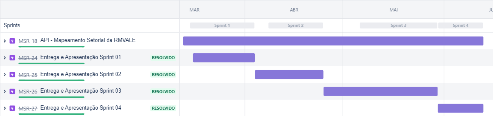

Sprint 01

>Backlog

      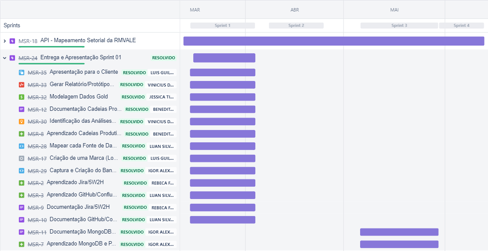

  
>Burndown Chart

_Por Tempo_

      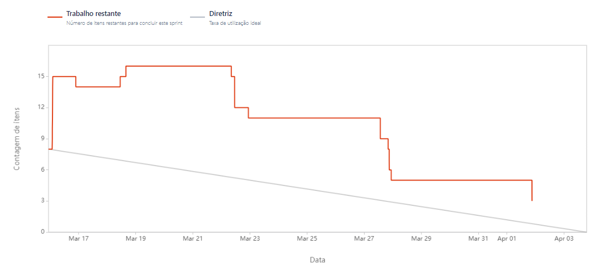

_Por Tempo_

      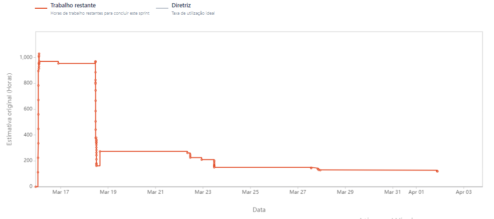

  
 

  

Sprint 02

>Backlog

      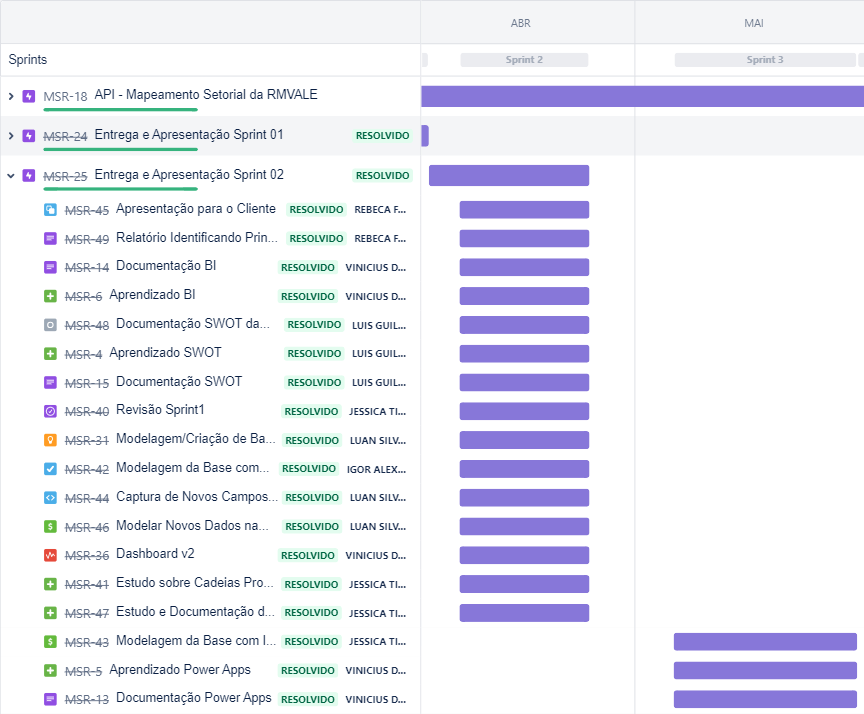

  
>Burndown Chart
  
_Por Itens_

      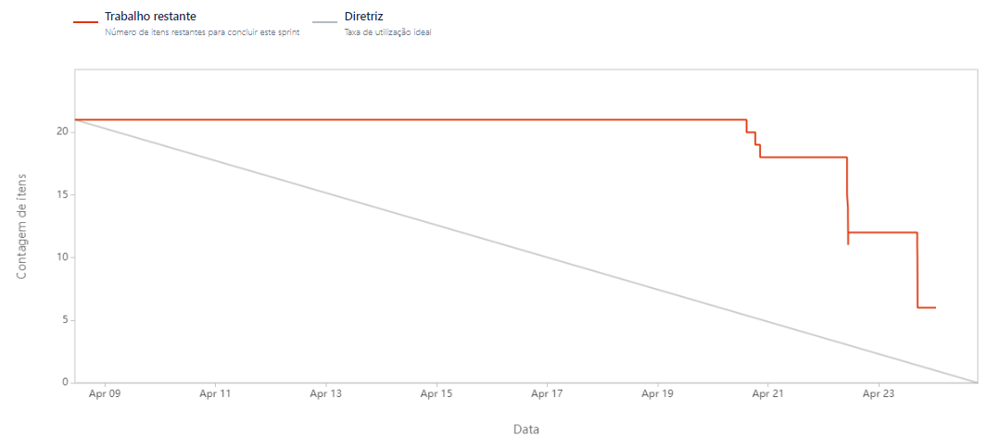

  
_Por Tempo_

      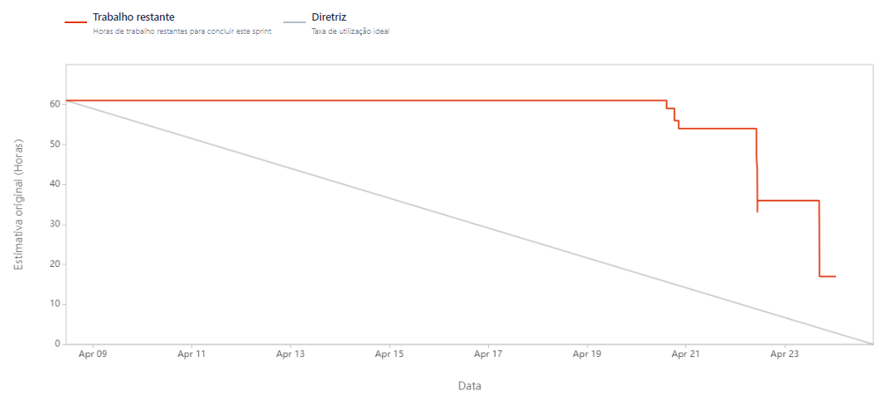

  
  

  

Sprint 03

>Backlog

      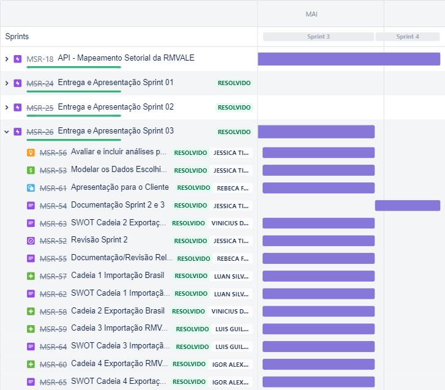

  
>Burndown Chart
  
_Por Itens_

      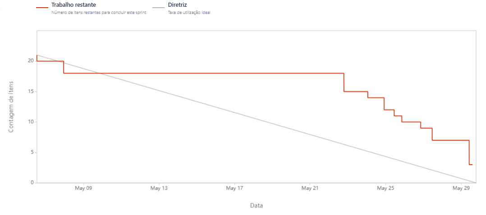

  
_Por Tempo_

      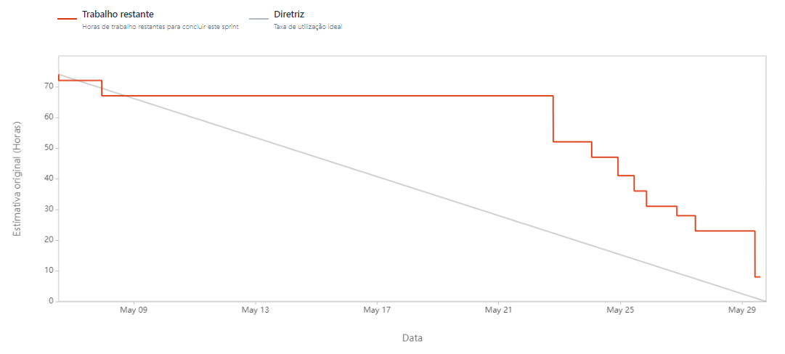

  
  

  

Sprint 04

>Backlog

      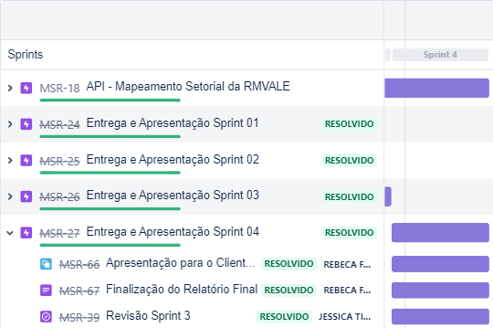

  
>Burndown Chart
  
_Por Itens_

      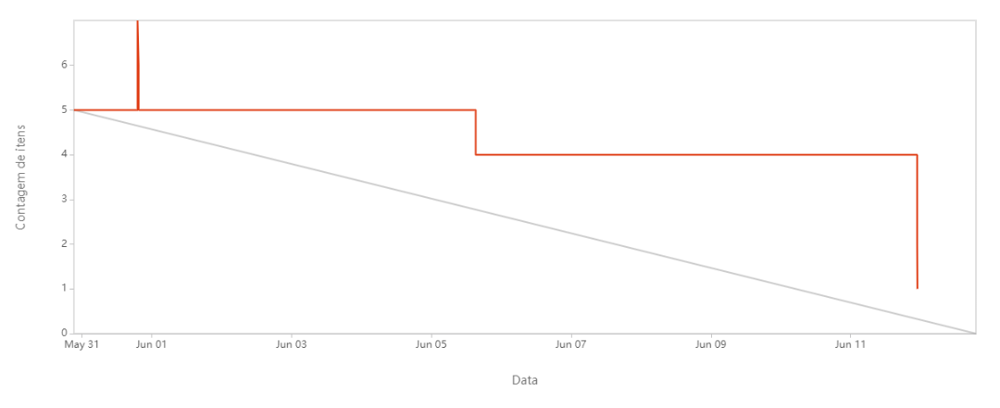

  
_Por Tempo_

      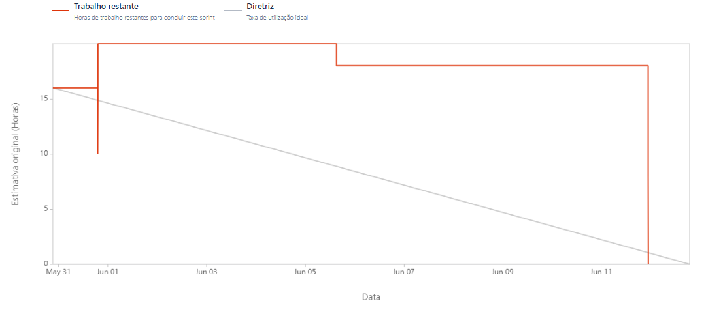

  
  

  

(<a href="#top">voltar ao topo</a>)

## Resultado e Produto

Por meio de modelagem de daos, obtivemos o protótipo de dashboard executado no software QuickSight, os filtros usados na base de dados para a apresentação do dashboard foram: base histórica de 1997 a 2023, do estado de São Paulos e dos dez maiores produtos de importação e exportação.

Com isso geramos gráficos pertinentes para analisar as cadeias produtivas da RMVale e do Brasil.

A proposta deste projeto foi realizar o mapeamento da RMVALE, de suas cadeias produtivas e valores referentes a importação e exportação dos produtos dentro delas, vemos que a partir dos resultados de cada sprint, a equipe conseguiu suprir a demanda do cliente com
um dashboard realizado no software QuickSight, possibilitando análises de quaisquer dados inseridos nele.

### Exemplos de Cadeias Produtivas da RMVALE

> CADEIA AERONÁUTICA SH4 – 8802 - EXPORTAÇÃO 1° RMVALE

      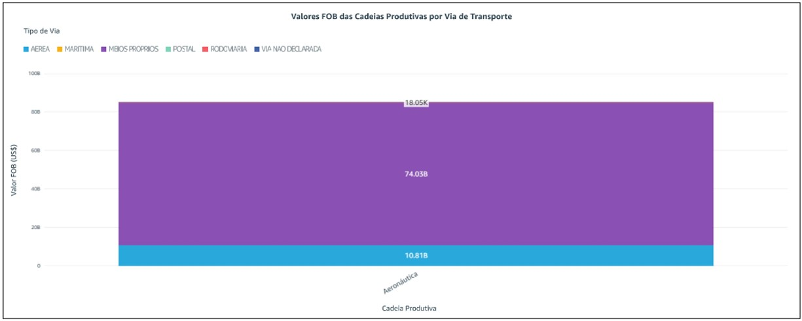

 
  

      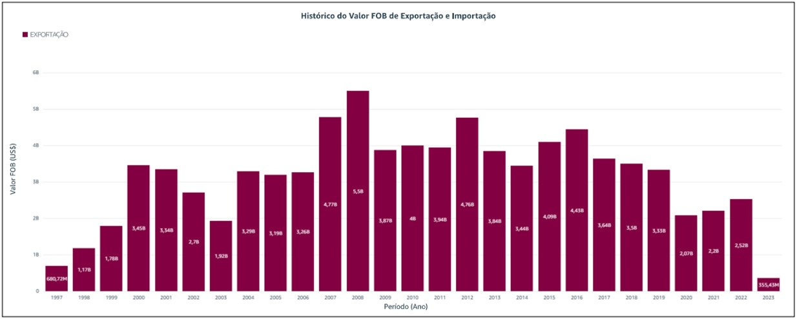

  

      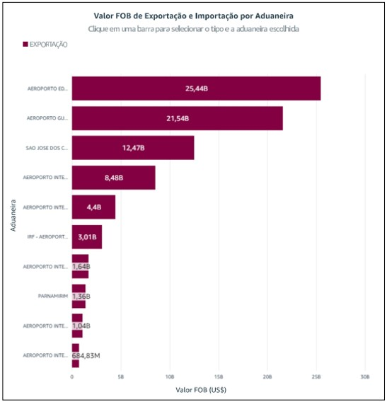
      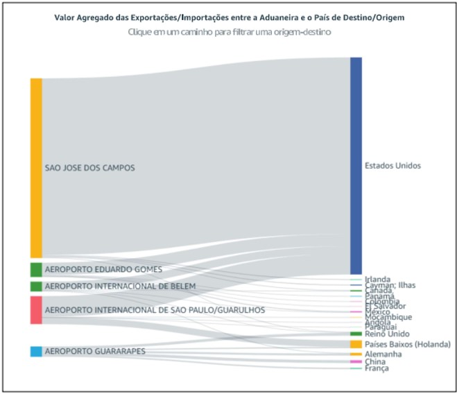

 

      

> CADEIA PETROLÍFERA SH4 – 2709 - IMPORTAÇÃO 1° RMVALE

  

      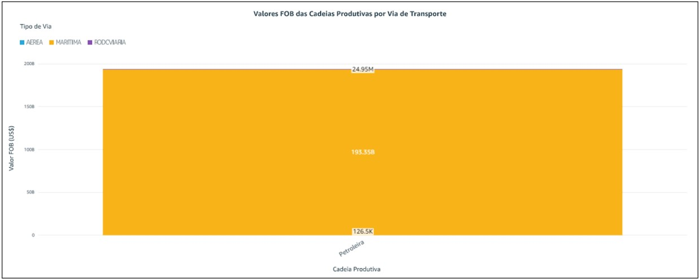

 
  

      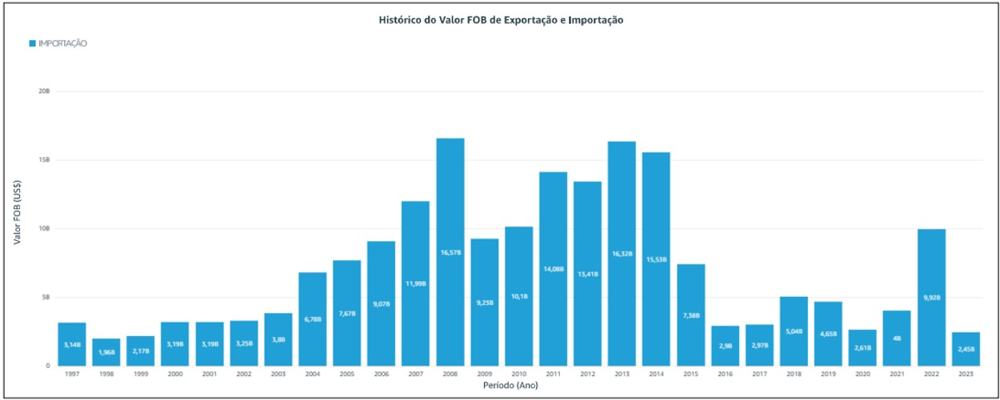

  

      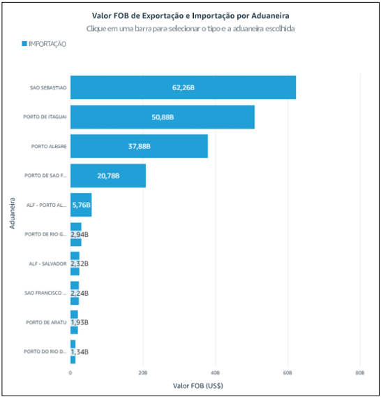
      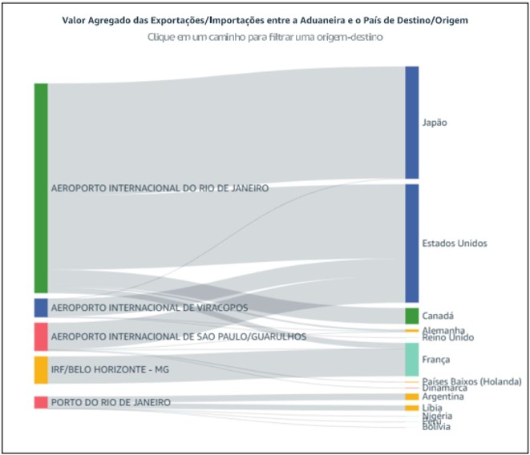

 

      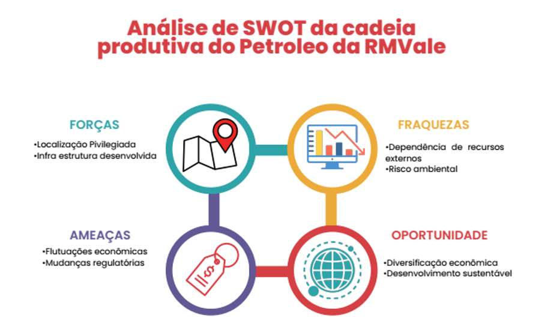

(<a href="#top">voltar ao topo</a>)

  
## Tecnologias Utilizadas

   
 <a href="https://www.atlassian.com/software/jira">
 

 

    
 
 <a href="https://jupyter.org/">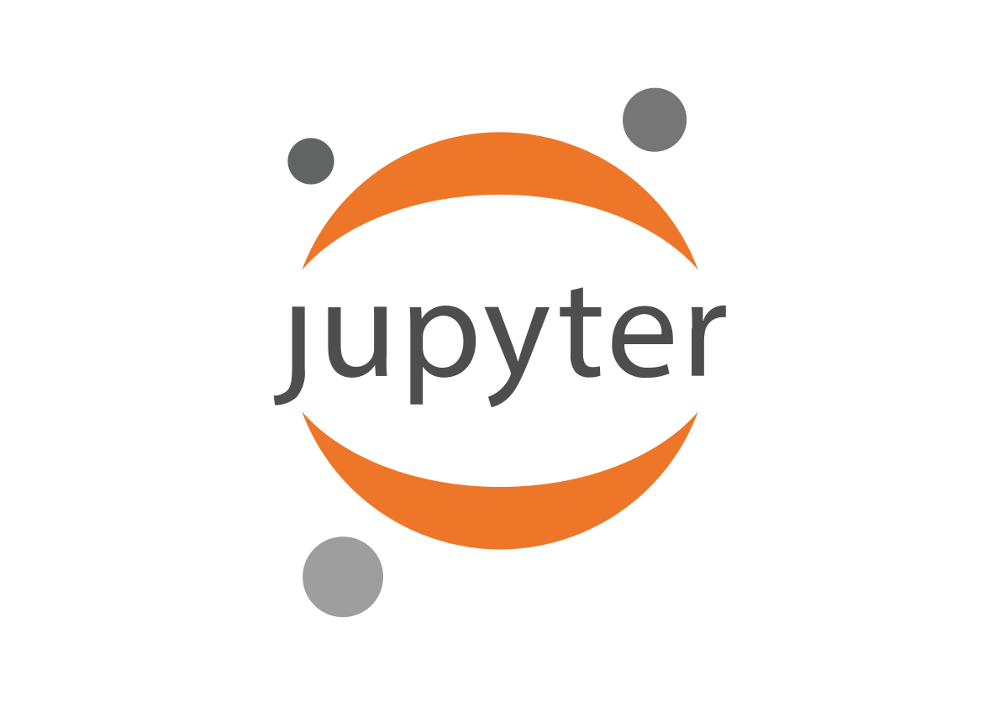</a>
 

(<a href="#top">voltar ao topo</a>)

  
  
  
  
  
  
